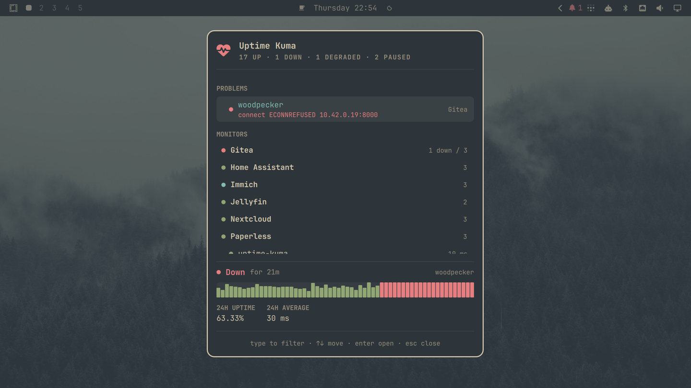

# Uptime Kuma for Omarchy

An operator view of an [Uptime Kuma](https://github.com/louislam/uptime-kuma)
instance, for Omarchy 4.x.

The bar stays empty while everything is healthy. When something breaks, an
indicator appears; `Super + U` opens the full view, with whatever is broken
pinned to the top and the error message Uptime Kuma actually recorded.



## Why another one

Two Uptime Kuma plugins already exist. Both are good at what they are, and both
read an interface that cannot carry what an operator view needs:

|                         | `/metrics`    | status page           | this     |
| ----------------------- | ------------- | --------------------- | -------- |
| Monitor groups          | no            | page sections only    | **yes**  |
| Error text of a failure | no            | blanked at the source | **yes**  |
| Update latency          | poll interval | 1–5 min server cache  | **push** |

This plugin speaks Uptime Kuma's Socket.IO interface — the one its own web UI
uses — so it sees the real parent/child hierarchy, the heartbeat message of a
failed check, and every state change as it happens.

## Requirements

- Omarchy 4.x (Quickshell shell)
- **Uptime Kuma 2.x** — 1.x is not supported
- An account **without** two-factor, or with, if you can enter a code once
- `curl`, `jq`, `secret-tool` — all present on a stock Omarchy

## Install

```bash
omarchy plugin add https://github.com/scoop/omarchy-plugin-uptime-kuma --enable
```

## Configure

Open the panel and fill in the form: the URL of your Uptime Kuma, your username,
your password, and a two-factor code if your account has one.

`shell.json` must be a regular file. It is opened with `O_NOFOLLOW`, so a
symlink there — which some dotfile setups create — is refused rather than
followed. That is deliberate: the file names the address this plugin sends your
credentials to, and a symlink is one more place something else could redirect
it.

Your password is exchanged once for a session token and is never stored. The
token goes into the login keyring; the URL and username are written to
`~/.config/omarchy/shell.json`. Changing your Uptime Kuma password revokes the
token, which asks you to sign in again — that is intended, not a fault.

Neither the password, the two-factor code nor the token is ever passed to
another program as a command-line argument or an environment variable, both of
which any process running as you can read. They travel on pipes.

Every helper the panel starts runs under `bin/supervise.sh`, in a process group
of its own and — apart from the poll, which runs until it is stopped — under a
deadline. Stopping one therefore stops the `curl` inside it too, rather than
leaving a request open under a shell that has already exited, and the supervisor
confirms the group has gone before it reports that it has.

An `https://` address, or an `http://` one pointing at this machine, connects
without comment. An `http://` address pointing anywhere else would put your
password and your session token on the wire where anything in between can read
them, so the form asks you to confirm that address specifically before it will
use it; the answer is remembered as `allowPlaintext` on the plugin's entry in
`shell.json`, and changing the URL asks again.

If the panel will not open — the shell is not running, or you are debugging a
keyring problem — the same exchange is available from a terminal:

```bash
~/.config/omarchy/plugins/scoop.uptime-kuma/bin/authenticate.sh
```

## Keybinding

The plugin cannot install a binding for you. Add to your Hyprland config:

```
bindd = SUPER, U, Uptime Kuma, exec, omarchy-shell shell toggle scoop.uptime-kuma
```

Clicking the indicator opens the same view.

## Using it

| Key     | Does                                 |
| ------- | ------------------------------------ |
| type    | filter monitors                      |
| `↑` `↓` | move                                 |
| `Enter` | open in Uptime Kuma, or fold a group |
| `Esc`   | clear the filter, then close         |

Groups, monitors and problems are all listed alphabetically, so where a thing
sits depends on what it is called rather than on when you created it.

Selecting a monitor shows its full error message plus how long it has held its
current status, a heartbeat sparkline, 24-hour uptime, latency, and certificate
expiry where Uptime Kuma reports one. Figures it has not reported are left out
rather than shown as a dash — not having measured something is not a
measurement.

Groups are folded shut by default, so a healthy instance is a dozen rows rather
than a wall of green. Anything down is pinned above the tree regardless, so
folding never hides a problem.

Paused monitors are hidden and only counted — Uptime Kuma is not checking them,
so they have nothing to report.

When the connection to Uptime Kuma is lost, the view says so and greys out. It
will not show you stale data that looks healthy.

## Removing

```bash
omarchy plugin remove scoop.uptime-kuma
```

That deletes the plugin folder. Two things it deliberately does not reach, both
of which you may want to clear yourself:

- **The session token, in your login keyring.** It survives removal, and it
  stays valid until your Uptime Kuma password changes. Clear it with:

    ```bash
    secret-tool clear service scoop.uptime-kuma account YOUR_USERNAME
    ```

- **`baseUrl`, `username` and `allowPlaintext`, on this plugin's entry in
  `~/.config/omarchy/shell.json`.** Removing the widget from your bar removes
  the entry and all three with it.

Nothing else is left behind: no cache, no state directory, and no service,
timer, hook or scheduled job — the plugin installs none. While a connection is
open the helper holds a cookie jar in `$XDG_RUNTIME_DIR`, created by `mktemp`
and readable only by you; it is deleted when that connection ends, and without a
private runtime directory the helper refuses to start rather than falling back
to shared `/tmp`. No process outlives the shell: each helper is torn down as a
process group when the panel stops it. The keybinding is the one you added by
hand, so it is yours to remove.

## Developing

Clone into `~/.config/omarchy/plugins/scoop.uptime-kuma` and work there —
plugin folders may not contain symlinks, so the usual symlink-the-repo trick
does not apply. Saving a file hot-reloads the shell.

```bash
bun test      # the wire codec, the domain model, the row builder
bun run lint
```

There is a canned snapshot for working on the panel without an Uptime Kuma to
point it at, and for regenerating the screenshot above:

```bash
omarchy-shell scoop.uptime-kuma.service demo
```

It replaces the in-memory state only — nothing is written, and restarting the
shell returns to the real instance. Its timestamps are slid to end at load time,
so durations read sensibly however old the file is.

The QML lives in three thin files; everything with logic in it is plain
JavaScript under `src/`, so it can be tested without a running shell.

Two gotchas worth knowing:

- **If an error's line number stops moving when you edit the file, restart the
  shell.** The QML engine caches a plugin's compiled component for the life of
  the shell process; hot-reload and even disable/enable will keep serving the
  old one. `omarchy-restart-shell`.
- `qmllint` and `qmlformat` in current Qt cannot parse typed function syntax
  (`function f(): void`), which Quickshell's IPC handlers require. They fail on
  a minimal example too. Do not chase it.

## Credit

Two plugins came first and taught this one things:

- [`p145085/omarchy-uptime-kuma`](https://github.com/p145085/omarchy-uptime-kuma)
  — the model/service/panel split, and a thorough hardening posture
- [`daanlenaerts/omakuma`](https://github.com/daanlenaerts/omakuma) — passing
  secrets to `curl` on stdin so they never reach the process table

Both MIT.

## License

MIT
